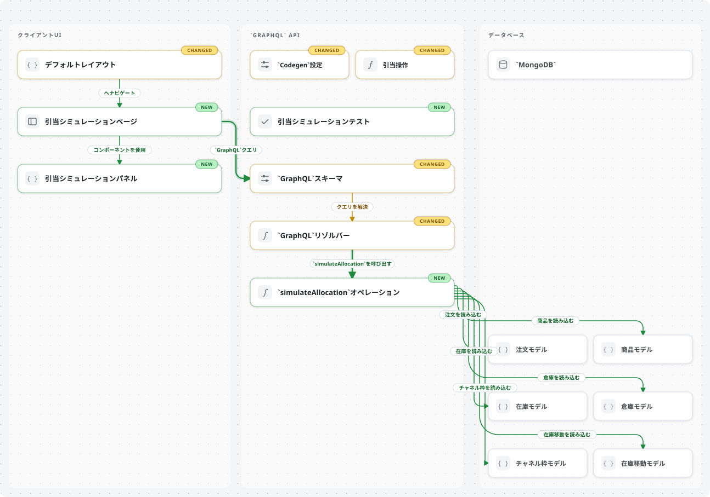

# pr-review-diagram

Claude Code / Cursor 共用スキル。PR 差分から Coldtea PR Lens 相当の構成図・データフロー SVG を作り、orphan ブランチと PR コメント画像で届けます。

- エージェントが Coldtea `schemaVersion 0.2.0` の `graph.json` を書く
- 実行時: `npx @coldtea/pr-lens-cli@latest validate` → `render --theme light`（MIT © Coldtea AI）
- 既定: **canvas へは push しない**（プライベート向き）。**GitHub App は不要**
- 見た目は Coldtea renderer の SVG（npm / Coldtea が使えないときだけ Mermaid フォールバック）

このリポジトリはスキル一式と手順のドキュメントです。Coldtea のソースは同梱しません。

## サンプル画像

架空の Acme SCM「引当シミュレーション」例から `npx @coldtea/pr-lens-cli render --theme light` で生成した SVG です。

### アーキテクチャ（コンテナビュー）



### データフロー



## インストール

Cursor は `.claude/skills/` も読むので、プロジェクトでは次のコピーだけで Claude Code と Cursor の両方に効きます。

```bash
# このリポを clone したあと
mkdir -p .claude/skills
cp -R pr-review-diagram .claude/skills/
```

個人グローバル:

```bash
# Claude Code
mkdir -p ~/.claude/skills
cp -R pr-review-diagram ~/.claude/skills/

# Cursor だけ別置きしたい場合
mkdir -p ~/.cursor/skills
cp -R pr-review-diagram ~/.cursor/skills/
```

## 使い方

- スラッシュ: `/pr-review-diagram`
- 自然言語: 「このPRの構成図を」「データフローを画像でコメントして」

流れ: 差分を読む → `.pr-diagram/graph.json` を書く → validate / render → orphan ブランチ `pr-diagram-assets` に SVG を置く → raw URL で PR コメント。詳細は `pr-review-diagram/SKILL.md`。

粒度の見本（架空の Acme SCM 機能 PR）:  
`pr-review-diagram/assets/example-acme-scm-allocation-sim.graph.json`

## 中身

| パス | 役割 |
| --- | --- |
| `pr-review-diagram/SKILL.md` | 操作手順 |
| `references/graph-document.md` | graph 要約とよくある validate エラー |
| `references/granularity.md` | レーン / ノード / フローの目安密度 |
| `assets/example-acme-scm-allocation-sim.graph.json` | 妥当な例示グラフ（架空） |
| `assets/comment-template.md` | 画像コメント用 Markdown |
| `scripts/render-mermaid.sh` | **任意** Mermaid→SVG フォールバックのみ |
| `docs/samples/*.svg` | README 用の生成サンプル |

## ライセンス

MIT © 2026 uzuraDev。

グラフ schema と CLI / renderer: MIT © Coldtea AI（`@coldtea/pr-lens-schema`, `@coldtea/pr-lens-cli`）。
